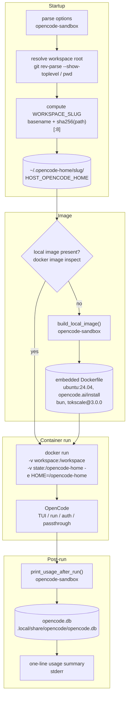

# Architecture

How `opencode-sandbox` resolves a workspace, builds its image, and runs OpenCode in a container.

## Flow

A single invocation resolves the workspace, ensures the local Docker image exists, runs OpenCode in an isolated container, and prints a token-usage summary on exit.

## Workspace resolution

If the current directory is inside a Git repository, the wrapper uses `git rev-parse --show-toplevel` as the workspace root; otherwise it uses the current directory. Git is optional: a non-Git directory works the same way, just without that auto-detection step.

## Per-workspace state and isolation

OpenCode state (auth tokens, session history) lives on the host under `~/.opencode-home/<slug>/`, where `<slug>` is the workspace directory's basename followed by a short hash of its absolute path (`opencode-sandbox`'s `sha256_hex()` / `WORKSPACE_SLUG`). Only the basename is human-readable; the full path is not encoded. That directory is mounted as the container's `HOME`.

This is the wrapper's isolation boundary between projects: two different directories that happen to share a basename (for example `~/work/api` and `~/play/api`) get distinct state dirs because the slug includes a hash of the full path, so their auth tokens and session history never mix. The basename alone would not be enough to prevent that collision, which is why the hash is there (see [Troubleshooting](troubleshooting.md) for the pre-hash legacy layout).

## Container boundaries

- The current workspace is mounted read-write at `/workspace`; the container has no access to the rest of the host filesystem beyond that mount and the per-workspace state directory.
- `--offline` runs the OpenCode container with `--network none`. The post-run usage summary and `--usage` run in a separate container that keeps networking (tokscale refreshes model pricing) and mounts the workspace's OpenCode state read-only. If no container should reach the network, add `--no-usage` (or `OPENCODE_NO_USAGE=1`) to skip the post-run summary and do not run `--usage`. `--offline` does not cover image acquisition: build or pull the image beforehand, because a first-run build of the default image, or an `OPENCODE_IMAGE` that is not present locally, still reaches the network.
- The default image is built locally from the embedded Dockerfile, but the build itself reaches external sources: it pulls `ubuntu:24.04` from Docker Hub, installs `curl`, `ca-certificates`, `git`, and `unzip` from the Ubuntu package archive, pipes the upstream `opencode.ai/install` and `bun.sh/install` scripts (not version-pinned) into `bash`, and installs `tokscale@3.0.0` from the npm registry. `--pull` rebuilds with `docker build --pull --no-cache`. Setting `OPENCODE_IMAGE` replaces all of this with the named registry image.
- The wrapper does not expose the Docker socket into the container, so OpenCode running inside it cannot itself launch further containers on the host.

`--usage --all` additionally mounts the whole `~/.opencode-home` read-only so usage can be aggregated across workspaces.

## Why a local Ubuntu (glibc) image

The upstream `ghcr.io/anomalyco/opencode` image is Alpine (musl), but OpenCode bundles a glibc-linked OpenTUI render library. On that image the TUI fails to initialize with `Error loading shared library ld-linux-x86-64.so.2` and the process hangs with a blank terminal. Building locally from `ubuntu:24.04` avoids it. See [anomalyco/opencode#28070](https://github.com/anomalyco/opencode/issues/28070).
